<a href="https://mhunterg.github.io/">
  <picture>
    <source media="(prefers-color-scheme: dark)" srcset="banners/bugs-dark.svg">
    <source media="(prefers-color-scheme: light)" srcset="banners/bugs-light.svg">
    
  </picture>
</a>
